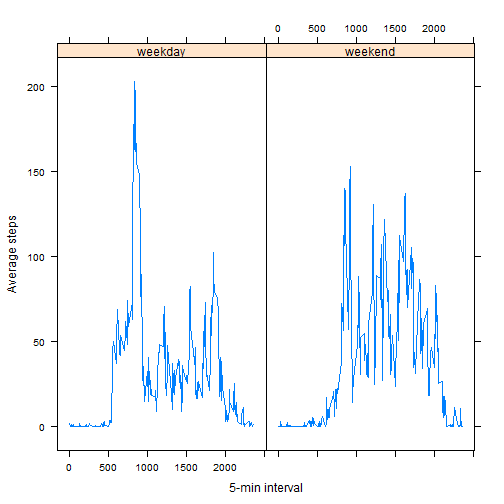

###Loading and preprocessing the data

**1. Load the data**

```r
options(scipen=999)

setwd("C:\\Users\\Crash_OverRide\\Documents\\Data Science\\Coursera\\Reproducible Reserach\\RepData_PeerAssessment1")

data <- read.csv("activity.csv")
head(data)
```

```
##   steps       date interval
## 1    NA 2012-10-01        0
## 2    NA 2012-10-01        5
## 3    NA 2012-10-01       10
## 4    NA 2012-10-01       15
## 5    NA 2012-10-01       20
## 6    NA 2012-10-01       25
```

**2. Process/transform the data (if necessary) into a format suitable for your analysis**

```r
data$date <- as.Date(data$date)
```


###What is mean total number of steps taken per day?

**1. Calculate the total number of steps taken per day**

```r
library(sqldf)

total_steps_daily <- sqldf("select date, sum(steps) as sum_steps
                           from data
                           where steps IS NOT \"NA\" 
                           group by date")

total_steps_daily$sum_steps <- as.numeric(total_steps_daily$sum_steps)
```

**2. If you do not understand the difference between a histogram and a barplot, research the difference between them. Make a histogram of the total number of steps taken each day**

```r
hist(total_steps_daily$sum_steps,
    xlab = "Total Daily Steps",
    main = "Histogram of Total Daily Steps",
    col = "blue")
```

 

**3. Calculate and report the mean and median of the total number of steps taken per day**

```r
mean_steps <- mean(total_steps_daily$sum_steps,na.rm=TRUE)
median_steps <- median(total_steps_daily$sum_steps,na.rm=TRUE)
```

The mean of the total steps taken per day is 10766.1886792 while the median of the total steps taken per day is 10765.

###What is the average daily activity pattern?

**1. Make a time series plot (i.e. type = "l") of the 5-minute interval (x-axis) and the average number of steps taken, averaged across all days (y-axis)**

```r
library (ggplot2)

avg_steps_per_5mininterval <- sqldf("select interval, avg(steps) as avg_steps
                         from data
                         where steps IS NOT \"NA\"
                         group by interval")

qplot(x=interval,y=avg_steps,data=avg_steps_per_5mininterval,
      geom="line",
      xlab = "5-min interval",
      ylab = "Average steps",
      main = "Average steps per 5-min interval")
```

 

**2. Which 5-minute interval, on average across all the days in the dataset, contains the maximum number of steps?**


```r
max_row <- which.max(avg_steps_per_5mininterval$avg_steps)
max_avg_steps <- avg_steps_per_5mininterval$interval[max_row]
```
The 835 5-min interval contains the maximum number of steps, averaged across all days. 

###Imputing missing values

**1. Calculate and report the total number of missing values in the dataset (i.e. the total number of rows with NAs)**

```r
summary(data)
```

```
##      steps             date               interval     
##  Min.   :  0.00   Min.   :2012-10-01   Min.   :   0.0  
##  1st Qu.:  0.00   1st Qu.:2012-10-16   1st Qu.: 588.8  
##  Median :  0.00   Median :2012-10-31   Median :1177.5  
##  Mean   : 37.38   Mean   :2012-10-31   Mean   :1177.5  
##  3rd Qu.: 12.00   3rd Qu.:2012-11-15   3rd Qu.:1766.2  
##  Max.   :806.00   Max.   :2012-11-30   Max.   :2355.0  
##  NA's   :2304
```

```r
total_na_steps <-sum(is.na(data$steps))
```

We have a total of 2304 rows of the steps variable that have an NA value.

**2. Devise a strategy for filling in all of the missing values in the dataset. The strategy does not need to be sophisticated. For example, you could use the mean/median for that day, or the mean for that 5-minute interval, etc.**

I will proceed forward by filling in the median number of steps for NA.

**3. Create a new dataset that is equal to the original dataset but with the missing data filled in**

```r
library(Hmisc)

data_imp <- data
data_imp$steps <- impute(data$steps,fun=median)
```

**4. Make a histogram of the total number of steps taken each day and Calculate and report the mean and median total number of steps taken per day. Do these values differ from the estimates from the first part of the assignment? What is the impact of imputing missing data on the estimates of the total daily number of steps?**

```r
total_steps_daily_imp <- sqldf("select date, sum(steps) as sum_steps
                           from data_imp
                           group by date")

total_steps_daily_imp$sum_steps <- as.numeric(total_steps_daily_imp$sum_steps)
hist(total_steps_daily_imp$sum_steps,
    xlab = "Total Daily Steps",
    main = "Histogram of Total Daily Steps (Imputed)",
    col = "blue")
```

 

```r
mean_steps_imp <- mean(total_steps_daily_imp$sum_steps)
median_steps_imp <- median(total_steps_daily_imp$sum_steps)
```

The mean total steps taken per day is 9354.2295082 while the median total steps taken per day is 10395. These values differ from the unimputed ones. After imputing the data, both estimates of the data are on the lower end since the median value that we filled in for NA values was a value of 0 steps. 

###Are there differences in activity patterns between weekdays and weekends?

**1. Create a new factor variable in the dataset with two levels - "weekday" and "weekend" indicating whether a given date is a weekday or weekend day.**

```r
data_imp$weekday <- ifelse(weekdays(data_imp$date) %in% c("Saturday","Sunday"),
                           "weekend","weekday")
```

**2. Make a panel plot containing a time series plot (i.e. type = "l") of the 5-minute interval (x-axis) and the average number of steps taken, averaged across all weekday days or weekend days (y-axis). See the README file in the GitHub repository to see an example of what this plot should look like using simulated data.**

```r
library(lattice)
library(plyr)

avg_steps_imp <- aggregate(steps ~ weekday+interval, 
                                            data=data_imp,
                                            mean)       


xyplot(steps ~ interval | factor(weekday), 
       data=avg_steps_imp, 
       type="l",
       xlab = "5-min interval",
       ylab= "Average steps")
```

 

